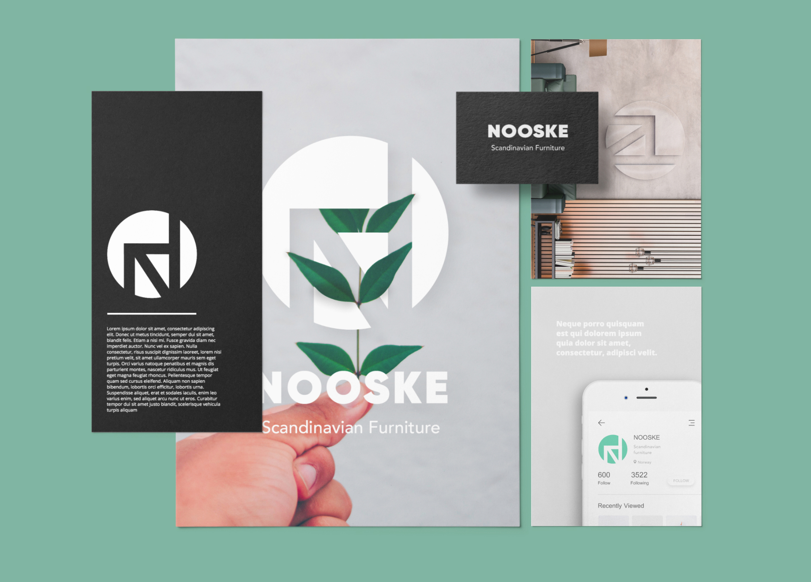

	

	<a class="" href="{{site.baseurl}}/index">Back to Home</a>
	
	<a class="" href="{{site.baseurl}}/heft">Next Project</a>
	

<header class="header">
	

	
		
		<h2 class=''>Nooske furniture</h2>
		

			<h1 class='project-title'>Nooske furniture</h1>
			

				

					

						<i class='icon-circle-compass'></i>
					

				
This project belongs primarily to the Logo identity design category. Technologies used: Notebook, Studio, Illustrator, Photoshop, among others.

				

				

					

						<a href='#' onclick="window.open('https://www.facebook.com/sharer/sharer.php?u='+encodeURIComponent(location.href), 'facebook-share-dialog', 'width=600,height=600'); return false;"><i class='icon-facebook1 link'></i></a>
						<a href="https://mail.google.com/mail/?view=cm&fs=1&to=fugitloop@gmail.com&su=Hi&body=My name is..." onclick="javascript:window.open(this.href,'', 'menubar=no,toolbar=no,resizable=yes,scrollbars=yes,height=600,width=600');return false;"><i class='icon-googleplus link'></i></a>
						<a href="javascript:void(0)" onclick="window.open( 'https://www.linkedin.com/in/juanantoniogodoyberner/', 'sharer', 'toolbar=0, status=0, width=600, height=600');return false;" title="Linkedin"><i class='icon-linkedin1 link'></i></a>
					

				
You’re able and encouraged to share this article, send me a message or find me on social media with the icons above. In the near future, I’ll be mostly active on Facebook, Gmail and LinkedIn. So you can find me on those platforms for now. Any comment is welcome about the content that here is presented.

				

				

					

						<i class='icon-book-open'></i>
					

				
This is one out of twelve projects where it's briefly described the process of thinking behind the design work. The quote below is from a different project.

				

			

		

	

</header>
<button class="trigger" data-info=""><a href="#section2" class="cd-scroll-down-w cd-image-replace bounce">scroll down</a></button>

	

		

			<aside class='project-parameters'>
						
					<b>Identity / Logotype</b>
					
Scandinavian lifestyle brand with focus on furniture for home. customers are women 25-45 years old.
	
			</aside>
		

		

			<article class="content">
				

					
<b>2019, Amsterdam, Netherlands.</b> Work for a Scandinavian brand that launched a line of furniture for home. The logo had to convey the sense of nature, design and minimalism. The process began in the notepad, drawing and writing sketches. I took into account the rules followed by <a href='https://en.wikipedia.org/wiki/Sagi_Haviv'>Sagi Haviv</a> (designer at <a href='https://www.cghnyc.com/'>Chermayeff & Geismar & Haviv</a>.), where a logo should be <i>appropriate</i>, <i>memorable</i> and <i>simple</i>.

					
<b>Using the first letter of the brand to work seems obvious, and it is</b>. The association of the letter and the name are now standardized by so many companies worldwide, that it makes easier the way we recognize them. Playing around in the notepad, the "N" shape became a good angle for the legs of a chair. From thre, every step fall into place very quickly. The logo was done very naturally by playing around with basic elements.

					
<b>Every time i see negative space adding meaning, i see minimalism</b>. Remembering what someone said (the design should be on what you take off, not what you put in); i tend to appreciate any trick better if it says a lot with very little. One of the begining quotes from the documentary <a href='https://www.imdb.com/title/tt1241325/'>Objectified</a>, goes like this: <i>“Many of the best examples of industrial design are things that people don’t think were designed at all. I mean, take the post-it note. It’s something we take for granted and something that people don’t think of as being designed.”</i> It's great to realize how quickly people actually make assumptions from anything they see.

					<blockquote>...Many of the best examples of industrial design are things that people don’t think were designed at all.</blockquote>
					

					
<b>To reach for context, i'll quote an article</b> by <a href='https://www.smashingmagazine.com/2011/06/the-story-of-scandinavian-design-combining-function-and-aesthetics/'>smashingmagazine</a> about the begginings of Scandinavian design: <i>"This ideology comes from local institutions, such as the long-established Swedish Society of Industrial Design. The goal of this association was to promote design that the general public could access and enjoy. Such goals were greatly affected by social changes taking place in Europe at the time. Even though the designs were democratic and meant for the masses, they were not stripped of all beauty in order to make them as easy to use as possible; an inspiring thought. The importance of this balance was identified by Scandinavians early on and has been maintained ever since".</i>

					

					
<b>And here an extract from: "How to design more with less"</b>, article written by <a href='https://designshack.net/articles/layouts/minimal-design-how-to-design-more-with-less/'>designshack</a>: <i>"Toss every element or bit of content that does not directly relate to the focal point. (This can be tough, but get rid of anything remotely extraneous.) Make the design almost too simple, keeping in mind that you can add elements back if necessary. Many times this step will help lend perspective on what really is and is not essential to the design".</i>

					<blockquote>...The importance of this balance was identified by Scandinavians early on and has been maintained ever since.</blockquote>
					

					
<b>Simplicity is the ultimate sophistication</b> — Leonardo Da Vinci.  What it was learned from this project is how to logically approach logo design, how to build visual representation from the purpose of the brand, finding balance between simplicity and a smart solution. That balance will come to fruition in the sketching process. Playing around with your pencil is a way to think on the paper, and you can only hope to find a <i>happy accident</i> that leads you to the unexpected solution.

				

			</article>
		

		

			<aside class='project-quote'>
					
"...Also, each cocktail comes in a different glass, therefore, it became important to bring those details upfront.

			</aside>
			<a class='fade-in' href='{{site.baseurl}}/heft'><button class="button button--rayen button--border-thin button--text-thick button--text-upper button--size-s" data-text="See this project">See this project</button></a>
		

	

